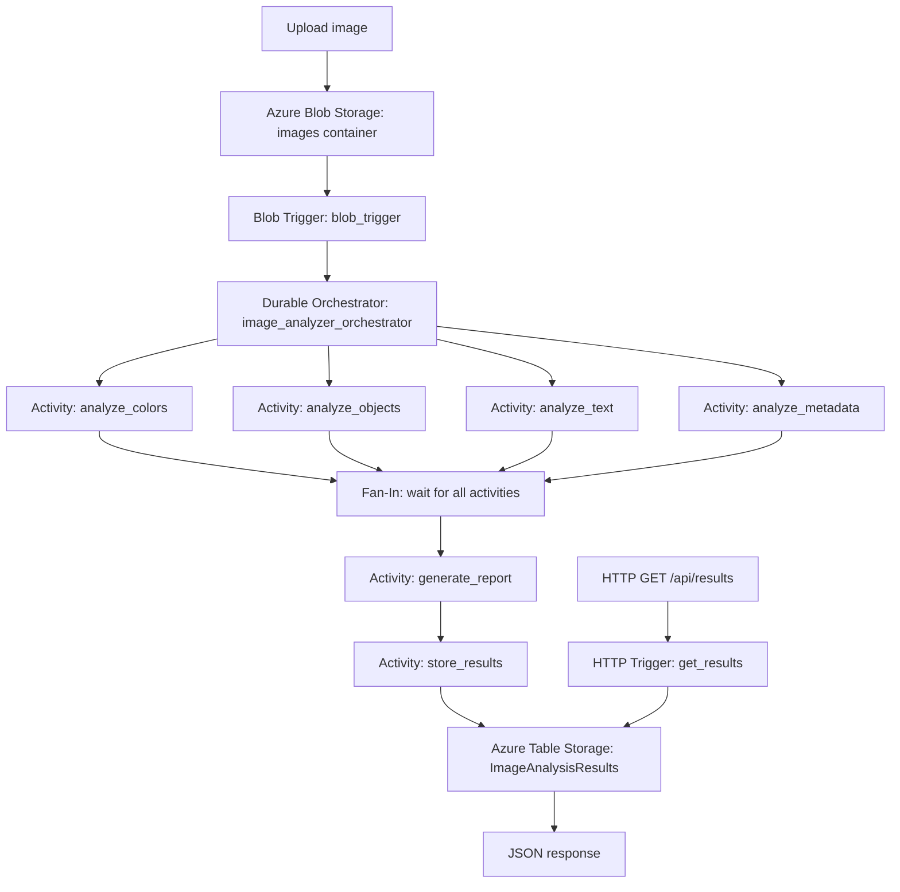

# CST8917 Lab 2 – Smart Image Analyzer with Azure Durable Functions

## Student Information

**Name:** Ilyas Zazai  
**Course:** CST8917 – Serverless Applications  
**Lab:** Lab 2 – Fan-Out/Fan-In and Function Chaining


## Demo Video


## Project Overview

In this lab, I built a serverless image-analysis application using Azure Durable Functions and the Python v2 programming model.

When an image is uploaded to the `images` Blob Storage container, a Blob Trigger starts a Durable Functions orchestration. The orchestrator runs four image-analysis activities in parallel. After all activities finish, the application combines their results, stores the final report in Azure Table Storage, and makes the stored results available through an HTTP endpoint.

The application was tested locally with Azurite and deployed to Microsoft Azure.

## Architecture



## Application Flow

1. I upload an image to the `images` Blob Storage container.
2. The `blob_trigger` function detects the uploaded image.
3. The Blob Trigger starts the `image_analyzer_orchestrator`.
4. The orchestrator starts four activity functions in parallel:
   - `analyze_colors`
   - `analyze_objects`
   - `analyze_text`
   - `analyze_metadata`
5. The orchestrator waits for all four activities using `context.task_all()`.
6. The `generate_report` activity combines the results.
7. The `store_results` activity saves the final report in Azure Table Storage.
8. The `get_results` HTTP endpoint retrieves the stored reports.

## Durable Functions Pattern

This application uses a hybrid Durable Functions pattern:

### Fan-Out

The orchestrator starts multiple independent activities at approximately the same time:

```python
analysis_tasks = [
    context.call_activity("analyze_colors", input_data),
    context.call_activity("analyze_objects", input_data),
    context.call_activity("analyze_text", input_data),
    context.call_activity("analyze_metadata", input_data),
]
```

### Fan-In

The orchestrator waits until all four activities finish:

```python
results = yield context.task_all(analysis_tasks)
```

### Function Chaining

After the parallel activities finish, the workflow continues sequentially:

```text
generate_report
      ↓
store_results
```

## Function List

| Function | Trigger Type | Purpose |
|---|---|---|
| `blob_trigger` | Blob Trigger and Durable Client | Detects uploaded images and starts the orchestration |
| `image_analyzer_orchestrator` | Orchestration Trigger | Coordinates the complete workflow |
| `analyze_colors` | Activity Trigger | Finds dominant colours and checks whether the image is grayscale |
| `analyze_objects` | Activity Trigger | Performs mock object detection |
| `analyze_text` | Activity Trigger | Performs mock text or OCR analysis |
| `analyze_metadata` | Activity Trigger | Extracts dimensions, format, mode, and file size |
| `generate_report` | Activity Trigger | Combines the analysis results into one report |
| `store_results` | Activity Trigger | Saves the report in Azure Table Storage |
| `get_results` | HTTP Trigger | Retrieves one or all saved analysis reports |

## Technologies Used

- Python 3.12
- Azure Functions Python v2 programming model
- Azure Durable Functions
- Azure Blob Storage
- Azure Table Storage
- Azure Functions Core Tools
- Azurite
- Pillow
- Azure CLI
- Linux Consumption hosting plan

## Project Structure

```text
lab2-fanin-fanout-chaining/
├── function_app.py
├── requirements.txt
├── host.json
├── local.settings.example.json
├── test-function.http
├── test-image.png
├── README.md
└── .gitignore
```

The following local or private files are not committed:

```text
local.settings.json
.venv/
.azurite/
.python_packages/
__pycache__/
azure-resources.env
```

## Local Setup and Testing

### 1. Clone the repository

```bash
git clone YOUR_REPOSITORY_URL
cd lab2-fanin-fanout-chaining
```

### 2. Create a Python virtual environment

```bash
python3 -m venv .venv
source .venv/bin/activate
```

### 3. Install the dependencies

```bash
python -m pip install -r requirements.txt
```

### 4. Create the local settings file

```bash
cp local.settings.example.json local.settings.json
```

The local settings use Azurite:

```json
{
  "IsEncrypted": false,
  "Values": {
    "AzureWebJobsStorage": "UseDevelopmentStorage=true",
    "FUNCTIONS_WORKER_RUNTIME": "python",
    "ImageStorageConnection": "UseDevelopmentStorage=true"
  },
  "Host": {
    "CORS": "*"
  }
}
```

### 5. Start Azurite

In Terminal 1:

```bash
azurite \
  --location .azurite \
  --debug .azurite/debug.log \
  --skipApiVersionCheck
```

The `--skipApiVersionCheck` option allows the installed Azure CLI Storage API version to work with the local Azurite version.

### 6. Start the Azure Functions application

In Terminal 2:

```bash
source .venv/bin/activate
func start
```

The Functions host discovers these functions:

```text
get_results
analyze_colors
analyze_metadata
analyze_objects
analyze_text
blob_trigger
generate_report
image_analyzer_orchestrator
store_results
```

### 7. Configure the local Azurite connection

In Terminal 3:

```bash
DEV_CONNECTION='DefaultEndpointsProtocol=http;AccountName=devstoreaccount1;AccountKey=Eby8vdM02xNOcqFlqUwJPLlmEtlCDXJ1OUzFT50uSRZ6IFsuFq2UVErCz4I6tq/K1SZFPTOtr/KBHBeksoGMGw==;BlobEndpoint=http://127.0.0.1:10000/devstoreaccount1;QueueEndpoint=http://127.0.0.1:10001/devstoreaccount1;TableEndpoint=http://127.0.0.1:10002/devstoreaccount1;'
```

### 8. Create the local `images` container

```bash
az storage container create \
  --name images \
  --connection-string "$DEV_CONNECTION"
```

### 9. Upload an image locally

```bash
az storage blob upload \
  --container-name images \
  --name "local-test-$(date +%s).png" \
  --file test-image.png \
  --connection-string "$DEV_CONNECTION" \
  --overwrite
```

### 10. Retrieve the local results

```bash
curl -s http://localhost:7071/api/results | python3 -m json.tool
```

Successful local result:

```json
{
  "count": 1,
  "results": [
    {
      "id": "f33abeea-f47b-4840-a9b8-1d5bd85ebca8",
      "fileName": "local-test-1783737121.png",
      "analyzedAt": "2026-07-11T02:32:07.995887",
      "summary": {
        "imageSize": "800x450",
        "format": "PNG",
        "dominantColor": "#2060a0",
        "objectsDetected": 2,
        "hasText": false,
        "isGrayscale": false
      }
    }
  ]
}
```

## Azure Resources

| Azure Resource | Name |
|---|---|
| Resource Group | `rg-cst8917-lab2-ilyas` |
| Storage Account | `stimgilyas735689` |
| Function App | `ilyas-image-analyzer-735689` |
| Blob Container | `images` |
| Table Storage | `ImageAnalysisResults` |
| Region | `East US 2` |
| Hosting Plan | Linux Consumption |
| Runtime | Python 3.12 |

## Azure Portal Deployment Steps

The Azure resources can be created manually through the Azure Portal using the following steps.

### 1. Create the Resource Group

1. Sign in to the Azure Portal.
2. Search for **Resource groups**.
3. Select **Create**.
4. Choose the correct Azure subscription.
5. Enter:

```text
Resource group: rg-cst8917-lab2-ilyas
Region: East US 2
```

6. Select **Review + create**.
7. Select **Create**.

### 2. Create the Storage Account

1. Search for **Storage accounts**.
2. Select **Create**.
3. Choose the same subscription and resource group.
4. Enter:

```text
Storage account name: stimgilyas735689
Region: East US 2
Performance: Standard
Redundancy: Locally-redundant storage (LRS)
```

5. Keep the remaining settings at their default values.
6. Select **Review + create**.
7. Select **Create**.

### 3. Create the Blob Container

1. Open the Storage Account.
2. Under **Data storage**, select **Containers**.
3. Select **+ Container**.
4. Enter:

```text
Name: images
Anonymous access level: Private
```

5. Select **Create**.

### 4. Create the Table Storage Table

1. Open the Storage Account.
2. Under **Data storage**, select **Tables**.
3. Select **+ Table**.
4. Enter:

```text
Table name: ImageAnalysisResults
```

5. Select **OK** or **Create**.

### 5. Create the Function App

1. Search for **Function App**.
2. Select **Create**.
3. Select the **Consumption** hosting option.
4. Enter the following settings:

```text
Resource group: rg-cst8917-lab2-ilyas
Function App name: ilyas-image-analyzer-735689
Runtime stack: Python
Version: 3.12
Region: East US 2
Operating system: Linux
Hosting plan: Consumption
```

5. Select the existing Storage Account:

```text
stimgilyas735689
```

6. Continue through the remaining tabs.
7. Select **Review + create**.
8. Select **Create**.

A Basic App Service Plan is not used because this application is designed as an event-driven serverless workload.

### 6. Get the Storage Account Connection String

1. Open the Storage Account.
2. Under **Security + networking**, select **Access keys**.
3. Select **Show keys**.
4. Copy one of the connection strings.

The connection string must be treated as a secret and must not be committed to GitHub.

### 7. Configure the Function App Settings

1. Open the Function App.
2. Select **Settings**.
3. Select **Environment variables** or **Configuration**.
4. Under **Application settings**, add or update:

```text
AzureWebJobsStorage = STORAGE_ACCOUNT_CONNECTION_STRING
ImageStorageConnection = STORAGE_ACCOUNT_CONNECTION_STRING
FUNCTIONS_WORKER_RUNTIME = python
FUNCTIONS_EXTENSION_VERSION = ~4
SCM_DO_BUILD_DURING_DEPLOYMENT = true
ENABLE_ORYX_BUILD = true
```

5. Select **Apply** or **Save**.
6. Restart the Function App when requested.

### 8. Publish the Function Code from VS Code

1. Open the project folder in Visual Studio Code.
2. Install the **Azure Functions** extension if it is not already installed.
3. Select the **Azure** icon from the left sidebar.
4. Sign in to the same Azure account used to create the resources.
5. Under **Resources**, expand the correct subscription.
6. Expand **Function App**.
7. Right-click `ilyas-image-analyzer-735689`.
8. Select **Deploy to Function App**.
9. Select the current project folder when VS Code asks for the deployment source.
10. Confirm the deployment when the warning message appears.
11. Wait until VS Code displays a successful deployment notification.
12. Open the Function App in the Azure Portal and select **Functions** to confirm that all functions were deployed.

After deployment, the Function App contains the Blob Trigger, Durable Functions orchestrator, four activity functions, report generation function, storage function, and HTTP results function.

## Azure Testing

### Upload an image through the Azure Portal

1. Open the Storage Account.
2. Select **Data storage**.
3. Select **Containers**.
4. Open the `images` container.
5. Select **Upload**.
6. Browse to `test-image.png`.
7. Select **Upload**.

Uploading the image starts the Blob Trigger and Durable Functions workflow.

### Check the saved Table Storage result

1. Open the Storage Account.
2. Select **Storage browser**.
3. Select **Tables**.
4. Open `ImageAnalysisResults`.
5. Confirm that a new entity was added.

### Retrieve the result through the HTTP endpoint

Open:

```text
https://ilyas-image-analyzer-735689.azurewebsites.net/api/results
```

The endpoint returns all saved image-analysis reports as JSON.

Successful Azure result:

```json
{
  "count": 1,
  "results": [
    {
      "id": "40fba1c0-8484-410b-b354-407ecdfe1478",
      "fileName": "test-image-735689.png",
      "summary": {
        "imageSize": "800x450",
        "format": "PNG",
        "dominantColor": "#2060a0",
        "objectsDetected": 2,
        "hasText": false,
        "isGrayscale": false
      }
    }
  ]
}
```

## HTTP Endpoint

### Local

```http
GET http://localhost:7071/api/results
```

Retrieve a specific report:

```http
GET http://localhost:7071/api/results/{id}
```

### Azure

```http
GET https://ilyas-image-analyzer-735689.azurewebsites.net/api/results
```

## Security

I did not commit `local.settings.json` because it can contain sensitive storage connection strings.

I included `local.settings.example.json` with safe local development values.

The following files and directories are excluded using `.gitignore`:

```text
local.settings.json
azure-resources.env
.venv/
.azurite/
.python_packages/
__pycache__/
*.pyc
```

*AI is used for Documentation*